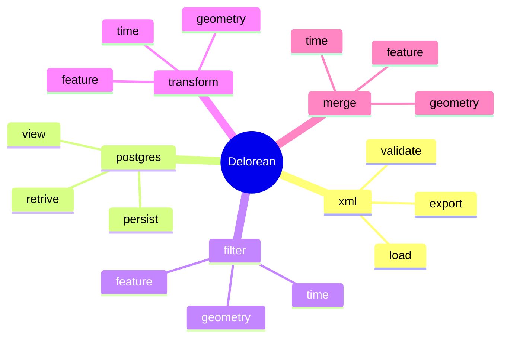

 ██████╗  ███████╗ ██╗       ██████╗  ██████╗  ███████╗  █████╗  ███╗   ██╗
 ██╔══██╗ ██╔════╝ ██║      ██╔═══██╗ ██╔══██╗ ██╔════╝ ██╔══██╗ ████╗  ██║
 ██║  ██║ █████╗   ██║      ██║   ██║ ██████╔╝ █████╗   ███████║ ██╔██╗ ██║
 ██║  ██║ ██╔══╝   ██║      ██║   ██║ ██╔══██╗ ██╔══╝   ██╔══██║ ██║╚██╗██║ 
 ██████╔╝ ███████╗ ███████╗ ╚██████╔╝ ██║  ██║ ███████╗ ██║  ██║ ██║ ╚████║ 
 ╚═════╝  ╚══════╝ ╚══════╝  ╚═════╝  ╚═╝  ╚═╝ ╚══════╝ ╚═╝  ╚═╝ ╚═╝  ╚═══╝ 

Deloreans is an open-source tool written in Java and targeted at PostgreSQL, allowing users to create, visualize, and work with AIXM datasets. While Delorean does the heavylifting between the xml and PostgreSQL the PostgreSQL is responsible for the visualisation and individual changes to the datasets.



Delorean support all features types found in aixm for the following aixm versions : 
    * [ ] 5_2 (in dev)
    * [x] 5_1_1
    * [x] 5_1
    * [ ] 5_0
    * [ ] 4_5

## License

Delorean is licensed under the MIT License.

## Using

TODO

## Building

The build process for delorean is complicated as it relies on the aixm xsd to build the entire aixm specific code base.
✨ Deloreans Rube goldberg build machine ✨
    1) Run ```mvn clean compile -P enable-jaxb```
    2) Delete the classes :
        a) ```src\main\java\com\aixm\delorean\core\schema\a5_1\aixm\message\Adapter1.java```
        b) ```src\main\java\com\aixm\delorean\core\schema\a5_1\aixm\Adapter1.java - Adapter8.java```
        c) ```src\main\java\com\aixm\delorean\core\schema\a5_1_1\aixm\message\Adapter1.java```
        b) ```src\main\java\com\aixm\delorean\core\schema\a5_1_1\aixm\Adapter1.java - Adapter8.java```
        e) ```src\main\java\com\aixm\delorean\core\org\gml\v_3_2\Adapter1.java```
    3) Remove the faulty code from
        a) ```src\main\java\com\aixm\delorean\core\org\gml\v_3_2\ObjectFactory.java [5064 - 5077]```
    4) Run ```python util\compilation\compilation_script.py```
    5) Run ```mvn clean compile```

## Bugs

TODO

## Community support

TODO

## Contributing

TODO

## More Information

```mermaid
classDiagram
    class AIXMMessage
    style AIXMMessage fill:#1b2847
    class AIXMPropertyGroup
    style AIXMPropertyGroup fill:#3a3447
    class AIXMTimeSlice
    style AIXMTimeSlice fill:#3a3447
    class AIXMFeature
    style AIXMFeature fill:#3a3447
    class AIXMObject
    style AIXMObject fill:#3a3447

    %% AIXM Message Relationship with Features
    AIXMMessage o-- AIXMFeature
    AIXMFeature --|> ConcreteFeatureType
    AIXMTimeSlice --|> ConcreteTimeSliceType
    AIXMPropertyGroup --|> SecondConcretePropertyType
    AIXMObject --|> ConcreteObjectType

    %% Compositions between concrete types
    ConcreteFeatureType --* FirstConcretePropertyType
    FirstConcretePropertyType --* ConcreteTimeSliceType
    ConcreteTimeSliceType --* SecondConcretePropertyType
    SecondConcretePropertyType --* ConcreteObjectType
    ConcreteObjectType --* ThirdConcretePropertyType

    %% Class Definitions
    class AIXMMessage { 
        +List~AIXMFeature~ Features
        +metadata
    }

    class AIXMPropertyGroup { 
        <<AbstractAIXMPropertyType>>
    }

    class AIXMTimeSlice { 
        <<AbstractAIXMTimeSliceType>>
    }

    class AIXMFeature { 
        <<AbstractAIXMFeature>>
    }

    class AIXMObject { 
        <<AbstractAIXMObject>>
    }

    class ConcreteFeatureType {
        +List~FirstConcretePropertyType~ TimeSlice
    }

    class FirstConcretePropertyType {
        +bool owns
        +ConcreteTimeSliceType ConcreteTimeSlice
    }

    class ConcreteTimeSliceType {
        +SecondConcretePropertyType ConcreteProperty
    }

    class SecondConcretePropertyType {
        +ConcreteObjectType ConcreteObject
    }

    class ConcreteObjectType {
        +ThirdConcretePropertyType ConcreteProperty
    }

    class ThirdConcretePropertyType {
    }
```

```mermaid
classDiagram
    class AbstractGMLType
    style AbstractGMLType fill:#3a3447
    class AbstractGeometryType
    style AbstractGeometryType fill:#3a3447
    class AbstractGeometricPrimitiveType
    style AbstractGeometricPrimitiveType fill:#3a3447
    class AbstractSurfaceType
    style AbstractSurfaceType fill:#3a3447
    class AbstractCurveType
    style AbstractCurveType fill:#3a3447
    class gmlSurfaceType
    style gmlSurfaceType fill:#3a3447
    class gmlPointType
    style gmlPointType fill:#3a3447
    class gmlCurveType
    style gmlCurveType fill:#3a3447

    AbstractGMLType --|> AbstractGeometryType
    AbstractGeometryType --|> AbstractGeometricPrimitiveType
    AbstractGeometricPrimitiveType --|> gmlPointType
    AbstractGeometricPrimitiveType --|> AbstractSurfaceType
    AbstractGeometricPrimitiveType --> AbstractCurveType
    AbstractSurfaceType --|> gmlSurfaceType
    AbstractCurveType --> gmlCurveType

    gmlSurfaceType --|> SurfaceType
    gmlPointType --|> PointType
    gmlCurveType --|> CurveType


    PointType --|> ElevatedPointType
    SurfaceType --|> ElevatedSurfaceType
    CurveType --|> ElevatedCurveType


    class AbstractGMLType{
        <<abstract>>
    }
    
    class AbstractGeometryType{
        <<abstract>>
    }
    
    class AbstractGeometricPrimitiveType{
        <<abstract>>
    }

    class AbstractSurfaceType{
        <<abstract>>
    }

    class AbstractCurveType{
        <<abstract>>
    }

    class gmlPointType{
        <<abstract>>
    }

    class gmlSurfaceType{
        <<abstract>>
    }

    class gmlCurveType{
        <<abstract>>
    }

    class PointType{

    }

    class SurfaceType{

    }

    class CurveType {

    }

    class ElevatedSurfaceType{

    }

    class ElevatedCurveType{

    }
```



