# Delorean

The idea for Deloran came after realising how hard it is to work with temporal data, especially with aixm and how empty the opensource landscape is for such tools.

Delorean's goal is to facilitate the use, exchange and structuring of temporal data, it's goal is to be used in conjunction with QGIS and POSTGRES. 

- Stage 1 will demonstrate the implementation of xsd defined schema that can convert seamlessly from xml to postgres and inversly
- Stage 2 will add temporality tools that will allow diferenty types of temporal checks, tools and methodes
- Stage 3 will create a QGIS plugin to simplify the everyday use with temporal data
- Stage 4 goal is to abstract away from a specific schema and allow custom xsd defined schema to be used as data schema with temporal structures 

### Documentation

Temporal feature structure can be layered in *insert number* layers that each allow more but comme with an addition cost in complexity: 

**Layer 0** 
Data has no temporality associated with it

- Data is indefinitly Valid
- Changes are instantenious
- Exports are snapshots

**Layer 1** 
Data can be temporary changed in the future (planned)

 - Decision date
 - Act date always in the future
 - Single Change allowed (current, next)

 

**Layer 2** 
Data can be temporary changed at any moment temporally

 - Decision date
 - Act date
 - Multiple change allowed (current, [stack])

### About

This temporal structure is achieved with a Feature / Timeslice / Property Structure : 

```mermaid
classDiagram
    DirectPositionType --* gml_PointType
    gml_PointType --> PointType
    AbstractAIXMPropertyType --> PointPropertyType
    PointType --* PointPropertyType

    class gml_PointType {
        DirectPositionType pos
        String id
        String srsName
        BigInteger srsDimension
        List[String] axisLabels
        List[String] uomLabels
    }

    class DirectPositionType {
        List[Double] value
    }

    class AbstractAIXMPropertyType {
        enum nilReason
    }

    class PointType {
        float horizontalAccuracy
        string annotation
    }

    class PointPropertyType {
        PointType point
        string horizontalAccuracy
        list[string] annotation
    }
```

### Goal

**AIXM Version covered :**
* [ ] Versions
    * [ ] 5_2
    * [x] 5_1_1
    * [ ] 5_1
    * [ ] 5_0
    * [ ] 4_5

**Functions :**
* [x] Load
    * [x] xml
    * [ ] psql
* [ ] Export
    * [x] xml
    * [ ] psql
* [ ] Edit
* [ ] Format
* [ ] Transform
* [ ] Validate
* [ ] Extract
* [ ] Core

### HLA

delorean interaction Map

delorean capability Map

xsd / xjb processing tree

