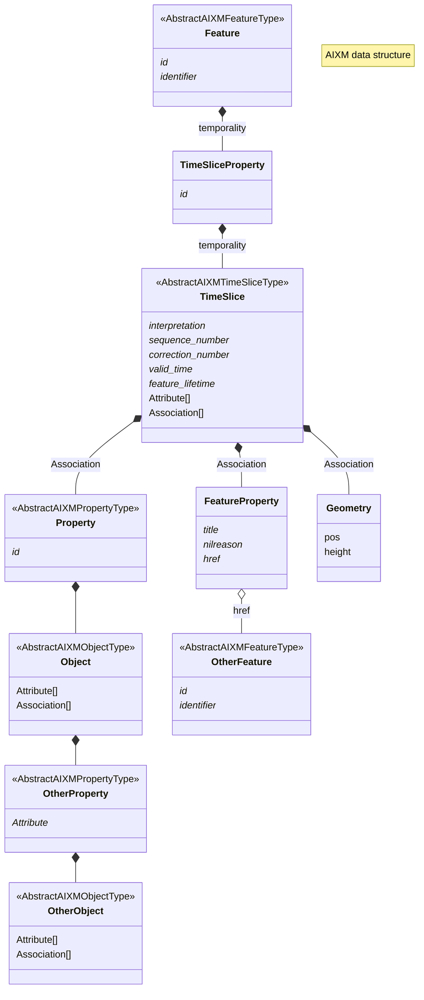

# AIXM Visualisation Solution
To visualise AIXM data, we must address a set of core functionalities.
-   **Temporal Validity**
    -   AIXM uses a time-sliced model where features have different states over time.
    -   The visualization must reflect the correct **snapshot in time**, accounting for **validTime** and **correctionNumber** to show only the relevant data.
-   **Feature Interlinking**
    -   AIXM data relies heavily on **xlinks** and references between features (e.g., a runway referring to an airport).
    -   Visualization must allow navigation through these links.
    -   The reverse navigation must also be possible these links.
-   **Object and Property**
    -   Features can have complex relationships with objects and properties, this must be resolved in order to display its entire content.
-   **Units of Measurement**
    -   Many AIXM properties can include a **value and a unit** (e.g., altitude in feet or meters).
    -   Visualization must respect and display the correct units, ideally allowing for conversion where needed.
-   **Precision and Formatting**
    -   Some values include a defined or implied **number of decimals** (e.g., coordinates, angles).
    -   Display should preserve or appropriately format values based on expected precision (e.g., 45.000° vs 45°).
-  **Geometry Rendering**
    -   AIXM features often include **geometries** (e.g., polygons for airspaces).
    -   Proper rendering on a map is essential, including handling CRS (coordinate reference system), boundaries, and multi-part geometries.
-  **Version and Correction**
    -   AIXM features can exist in multiple versions or corrections.
    -   Visualization should either display the latest valid state or allow users to explore version history.
-  **Metadata and Annotations**
    -   Some features may include notes, restrictions, or metadata relevant for interpretation.
    -   These should be visible in a contextual or interactive way.

To address these issues, the technical solution implemented in delorean relies on a combination of sql views and qgis layer management, which are described in detail here. We must keep in mind that, although we are used to seeing AIXM in its message form, we are dealing here with a more abstract representation of it. In our database, we have a set of features and a set of messages (datasets). We don't just want to display all our features; we want to display the right feature for the right dataset. This is necessary because a feature can be in different datasets, each of which serves a specific purpose.




### Temporal Validity
Going top to bottom we must first Select the right data set ```AIXMBasicMessageType``` which contains a list of ```BasicMessageMemberAIXMPropertyType``` which contain ```AbstractAIXMFeatureType``` . This ```AbstractAIXMFeatureType``` is implemented as ```Feature``` which has a list of ```FeatureTimeSlicePropertyType``` which contain ```FeatureTimeSliceType```. However, this is not enough. We must also ignore the stale and unapproved correction timeslices (delorean attribute supports incremental edits).

the concrete sql view implementation looks like this : 
````sql
create or replace view feature_publisher_view as
select distinct on (feature.identifier,feature_time_slice.sequence_number)
*
from aixm_basic_message
inner join aixm_basic_message_basic_message_member
	on aixm_basic_message.id = aixm_basic_message_basic_message_member.aixm_basic_message_id
inner join basic_message_member
	on aixm_basic_message_basic_message_member.basic_message_member_id = basic_message_member.id
inner join feature
	on basic_message_member.abstract_aixm_feature_id = feature.id
inner join master_join
	on feature.id = master_join.source_id
inner join feature_time_slice_property
	on master_join.target_id = feature_time_slice_property.id
inner join feature_time_slice
	on feature_time_slice_property.featuretimeslice_id = feature_time_slice.id
where
	feature_time_slice.feature_status = 'APPROVED'
	
order by feature.identifier, feature_time_slice.sequence_number, feature_time_slice.correction_number DESC;
````

This will select all features with the highest correction number and all sequence numbers from all the datasets.

This offers the most flexibility, as we can now implement a QGIS layer with filters on the dataset name and validity time.
	
qgis query expression 
```

```
qgis dynamic temporal control config
```xml
<temporal  	enabled="1"
			accumulate="0"
			durationField="row"
			startField="valid_time_begin"
			durationUnit="min"
			limitMode="0"
			endField="valid_time_end"
			startExpression=""
			mode="2"
			endExpression=""
			fixedDuration="0">
	<fixedRange>
		<start/>
		<end/>
	</fixedRange>
</temporal>
```

### Values, UOM and Nilreason
Attributes contain much more than values. By combining the columns 'value', 'uom' and 'nilreason', we can create a clear attribute that displays all possible value ranges directly in the SQL view.

```sql
SELECT 
-- 100.12345 ft
coalesce('100.12345'::text || ' ' || coalesce('ft', ''), '(' || '' || ')'),

-- 100.12345 ft
coalesce('100.12345'::text || ' ' || coalesce('ft', ''), '(' || null  || ')'),

-- 100.12345
coalesce('100.12345'::text || ' ' || coalesce(null, ''), '(' || 'unknown' || ')'),

-- (unknown)
coalesce(null::text || ' ' || coalesce('ft', ''), '(' || 'unknown' || ')'),

-- (unknown)
coalesce(null::text || ' ' || coalesce(null, ''), '(' || 'unknown' || ')')

-- NULL
coalesce(null::text || ' ' || coalesce(null, ''), '(' || null || ')')
```

These values can then be used directly in qgis layers, split or grouped to allow for a simple ui : 

### Feature Interlinking
In QGIS, navigating between features is usually done by copying a name or ID and searching for it in another layer. A better way to achieve this would be to create an action item that takes the referenced UUID, searches for it and opens it in the other layer.

```

```
But this means that the uuid (href) must also be part of the sql view (which we use in the layer)

```

```

### Geometry Rendering

### Version and Correction Management